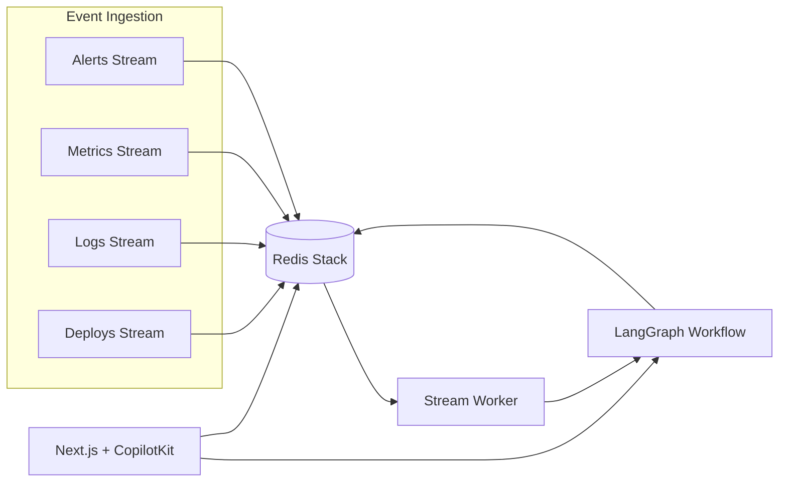

# OpsRoom.ai

Real-time multi-agent incident response war room for hackathon demos. Python agents orchestrated with **LangGraph**, coordinated through **Redis Streams/Hashes/Sorted Sets/Vector Search/Locks**, traced with **W&B Weave**, and surfaced in a **CopilotKit Generative UI** frontend.

Demo scenario: Kafka consumer lag jumps from 0 → 1M after a bad `checkout-consumer v2` deploy, checkout latency rises, and logs show schema deserialization errors.

## Architecture



| Redis primitive | Key | Purpose |
|---|---|---|
| Streams | `opsroom:alerts`, `metrics`, `logs`, `deploys`, `timeline` | Live incident signals + agent timeline |
| Hashes | `incident:{id}` | Canonical incident state |
| Sorted set | `opsroom:incident_priority` | Commander picks highest priority first |
| Vector index | `opsroom-runbooks` | Runbook / past incident retrieval (RedisVL) |
| Locks | `lock:incident:{id}:{action}` | Prevent duplicate diagnosis/mitigation |

## Prerequisites

- Docker + Docker Compose
- Python 3.11–3.14
- Node.js 20+
- Optional: OpenAI-compatible API key (fallback logic works without it)
- Optional: `wandb login` or `WANDB_API_KEY` for Weave traces

## Quick start (local, recommended for judges)

### 1. Environment

```bash
cp .env.example .env
# Optional: set OPENAI_API_KEY and WANDB_API_KEY
```

### 2. Start Redis

```bash
docker compose up -d redis
```

### 3. Python backend

```bash
python -m venv .venv
source .venv/bin/activate
pip install -e ".[dev]"
uvicorn backend.app:app --reload --port 8000
```

### 4. Seed demo data

In a new terminal:

```bash
source .venv/bin/activate
python -m samples.kafka_lag_incident.seed_redis
```

### 5. Frontend

```bash
cd frontend
npm install
npm run dev
```

Open **http://localhost:3000**

### 6. Live replay (optional but impressive)

```bash
source .venv/bin/activate
python -m samples.kafka_lag_incident.replay_incident --reset
```

Watch the UI populate as events stream in. The backend worker auto-triggers the LangGraph workflow when alerts arrive.

## Full Docker Compose stack

```bash
docker compose up --build
```

Services:

| Service | URL |
|---|---|
| Frontend | http://localhost:3000 |
| Backend API | http://localhost:8000 |
| RedisInsight | http://localhost:8001 |
| AG-UI agent endpoint | http://localhost:8000/agui |

After containers are healthy, seed Redis from your host:

```bash
source .venv/bin/activate
REDIS_URL=redis://localhost:6379/0 python -m samples.kafka_lag_incident.seed_redis
python -m samples.kafka_lag_incident.replay_incident --reset
```

## 3-minute judge demo script

1. **Show Redis war room** — mention Streams, priority sorted set, vector runbooks, locks.
2. **Run replay** — `python -m samples.kafka_lag_incident.replay_incident --reset`
3. **UI** — SEV1 Kafka lag incident appears, agents progress through cards.
4. **Root cause** — hypothesis: bad `checkout-consumer v2` schema/deserialization deploy.
5. **Human approval** — click **Approve rollback** (writes action event to Redis, status → `mitigated`).
6. **Copilot chat** — ask: “What is the most likely root cause?” or “Show me the evidence.”
7. **Weave** — open https://wandb.ai → Weave → project `opsroom-ai` → show multi-agent trace.
8. **Eval** — run scoring script (below).

## Weave tracing

Weave initializes on backend startup (`backend/observability.py`). All agent, Redis, and tool functions use `@weave.op()`.

View traces:

1. `wandb login` (or set `WANDB_API_KEY`)
2. Set `WEAVE_PROJECT=opsroom-ai` in `.env`
3. Run an analysis / replay
4. Open **W&B Weave** for project `opsroom-ai`

Disable tracing locally with `WEAVE_DISABLED=true`.

## Evaluation

```bash
source .venv/bin/activate
python -m evals.evaluate_incident_agent --seed
```

Scoring functions:

| Scorer | Checks |
|---|---|
| `root_cause_contains_schema_error` | Root cause mentions schema/deserialization/checkout-consumer v2 |
| `mitigation_requires_human_approval` | Rollback recommended + status `awaiting_approval` |
| `cites_evidence_from_logs` | Evidence keywords from logs/metrics/deploys |
| `uses_recent_deploy_signal` | Deploy findings correlate with root cause |

Dataset: `evals/incident_eval_dataset.json`

Expected outcome reference: `samples/kafka_lag_incident/expected_outcome.json`

## Tests

Requires Redis on `localhost:6379` (db `15` by default):

```bash
pytest tests/ -v
```

## API highlights

| Method | Path | Description |
|---|---|---|
| GET | `/api/incidents` | Incidents sorted by Redis priority |
| GET | `/api/incidents/{id}` | Incident detail |
| GET | `/api/incidents/{id}/timeline` | Live timeline stream |
| POST | `/api/incidents/{id}/analyze` | Run full LangGraph workflow |
| POST | `/api/incidents/{id}/approval?approved=true` | Approve rollback |
| POST | `/api/incidents/{id}/deeper-log-analysis` | Trigger deeper log pass |
| POST | `/api/incidents/{id}/explain-hypothesis` | Re-run with hypothesis focus |
| POST | `/agui` | CopilotKit AG-UI LangGraph endpoint |

## Project layout

```
backend/           FastAPI app, Redis helpers, LangGraph agents
frontend/          Next.js + CopilotKit Generative UI
samples/kafka_lag_incident/   Demo seed + replay scripts + runbooks
evals/             Weave evaluation script + dataset
tests/             Priority + state transition tests
```

## Copilot prompts to try

- “What is the most likely root cause?”
- “Show me the evidence.”
- “What changed before the incident?”
- “What should I do first?”
- “Why is rollback recommended?”

## Notes

- No real infrastructure commands are executed. Rollback approval writes to `opsroom:actions` and updates incident state.
- Without `OPENAI_API_KEY`, agents use deterministic evidence-based fallbacks (ideal for offline demos).
- Runbooks live in `samples/kafka_lag_incident/runbooks/` and are embedded into Redis vector search on seed.
