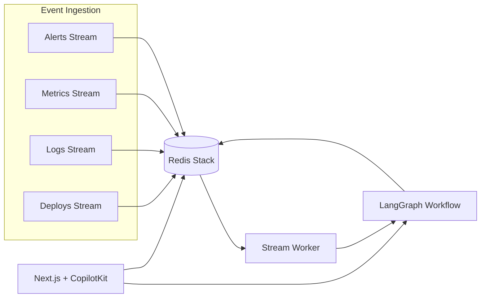

# OpsRoom.ai

Real-time multi-agent incident response war room for hackathon demos. Python agents orchestrated with **LangGraph**, coordinated through **Redis Streams/Hashes/Sorted Sets/Vector Search/Locks**, traced with **W&B Weave**, and surfaced in a **CopilotKit Generative UI** frontend.

Demo scenario: Kafka consumer lag jumps from 0 → 1M after a bad `checkout-consumer v2` deploy, checkout latency rises, and logs show schema deserialization errors.

## Architecture



| Redis primitive | Key | Purpose |
|---|---|---|
| Streams | `opsroom:alerts`, `metrics`, `logs`, `deploys`, `timeline` | Live incident signals + agent timeline |
| Hashes | `incident:{id}` | Canonical incident state |
| Sorted set | `opsroom:incident_priority` | Commander picks highest priority first |
| Vector index | `opsroom-runbooks` | Runbook / past incident retrieval (RedisVL) |
| Locks | `lock:incident:{id}:{action}` | Prevent duplicate diagnosis/mitigation |

## Prerequisites

- Docker + Docker Compose
- Python 3.11–3.14
- Node.js 20+
- Optional: OpenAI-compatible API key (fallback logic works without it)
- Optional: `wandb login` or `WANDB_API_KEY` for Weave traces

## One-command demo (recommended for judges)

```bash
cp .env.example .env   # optional: add OPENAI_API_KEY + WANDB_API_KEY
make demo
```

This will:
1. Start Redis via Docker
2. Install Python deps and seed the Kafka lag incident
3. Launch backend (`:8000`) and frontend (`:3000`)
4. Run **chaos replay** (`--delay 0.3`) so lag spikes visibly on screen

Stop everything:

```bash
make demo-stop
```

Re-run only the fast replay (backend + frontend already running):

```bash
make chaos
```

## Split-screen demo layout (UI + Weave)

For the strongest live demo, use **two windows side-by-side**:

```
┌─────────────────────────────┬─────────────────────────────┐
│  http://localhost:3000      │  W&B Weave (from /health)   │
│  ─────────────────────────  │  ─────────────────────────  │
│  • Incident list            │  • run_incident_workflow    │
│  • Live timeline  [LIVE]    │  • root_cause_agent         │
│  • Hypotheses + evidence    │  • search_runbooks          │
│  • Approve rollback         │  • mitigation_agent       │
└─────────────────────────────┴─────────────────────────────┘
```

The war room UI now includes a **Timeline | Weave** split panel with a clickable trace URL (from `GET /health`).

**macOS tip:** Full-screen the browser on the left; open Weave in a second window snapped to the right (`Window → Tile Window to Left/Right of Screen`).

Get the Weave URL anytime:

```bash
curl -s http://localhost:8000/health | python3 -m json.tool
```

## Quick start (manual steps)

### 1. Environment

```bash
cp .env.example .env
# Optional: set OPENAI_API_KEY and WANDB_API_KEY
```

### 2. Start Redis

```bash
docker compose up -d redis
```

### 3. Python backend

```bash
python -m venv .venv
source .venv/bin/activate
pip install -e ".[dev]"
uvicorn backend.app:app --reload --port 8000
```

### 4. Seed demo data

In a new terminal:

```bash
source .venv/bin/activate
python -m samples.kafka_lag_incident.seed_redis
```

### 5. Frontend

```bash
cd frontend
npm install
npm run dev
```

Open **http://localhost:3000**

### 6. Live replay (optional but impressive)

```bash
source .venv/bin/activate
python -m samples.kafka_lag_incident.replay_incident --reset --chaos
```

Or: `make chaos` — uses `--delay 0.3` for a ~30-second visible lag spike.

Watch the UI populate as events stream in. The backend worker auto-triggers the LangGraph workflow when alerts arrive.

## Full Docker Compose stack

```bash
docker compose up --build
```

Services:

| Service | URL |
|---|---|
| Frontend | http://localhost:3000 |
| Backend API | http://localhost:8000 |
| RedisInsight | http://localhost:8001 |
| AG-UI agent endpoint | http://localhost:8000/agui |

After containers are healthy, seed Redis from your host:

```bash
source .venv/bin/activate
REDIS_URL=redis://localhost:6379/0 python -m samples.kafka_lag_incident.seed_redis
python -m samples.kafka_lag_incident.replay_incident --reset
```

## 3-minute judge demo script

1. Run **`make demo`** (or have it already running).
2. **Split screen** — war room left, Weave trace tab right (click link in Timeline | Weave panel).
3. **Watch chaos replay** — lag climbs 0 → 1M, agents progress, timeline shows `LIVE`.
4. **Root cause** — evidence bullets cite metrics, logs, deploy from Redis.
5. **Human approval** — click **Approve rollback**.
6. **Copilot** — “What is the most likely root cause?”
7. **Weave** — expand `run_incident_workflow` trace, show hypotheses + confidence.
8. **Eval** — `python -m evals.evaluate_incident_agent --seed`

## Weave tracing

Weave initializes on backend startup (`backend/observability.py`). All agent, Redis, and tool functions use `@weave.op()`.

View traces:

1. `wandb login` (or set `WANDB_API_KEY`)
2. Set `WEAVE_PROJECT=opsroom-ai` in `.env`
3. Run an analysis / replay
4. Open **W&B Weave** for project `opsroom-ai`

Disable tracing locally with `WEAVE_DISABLED=true`.

## Evaluation

Runs scored eval suites in **Weave Evaluations** (Traces + **Evals** tab):

```bash
source .venv/bin/activate
python -m evals.evaluate_incident_agent --seed              # incident agents + copilot routing
python -m evals.evaluate_incident_agent --seed --suite incident
python -m evals.evaluate_incident_agent --suite copilot       # no Redis / LLM required
```

### Incident agent scorers

| Scorer | Checks |
|---|---|
| `root_cause_contains_keywords` | Root cause mentions scenario keywords |
| `mitigation_requires_human_approval` | Rollback recommended + status `awaiting_approval` (Kafka) |
| `cites_evidence_from_logs` | Evidence keywords from logs/metrics/deploys/hypotheses |
| `uses_recent_deploy_signal` | Deploy findings correlate with root cause |
| `hypothesis_confidence_alignment` | Top hypothesis confidence within ±15% of verdict |
| `top_hypothesis_has_smoking_gun` | Rank #1 hypothesis cites schema or memory proof |
| `log_findings_include_pattern` | Logs agent tagged expected error pattern |

### Copilot routing scorers

| Scorer | Checks |
|---|---|
| `copilot_panel_routing_accuracy` | Question opens the expected generative panel(s) |
| `copilot_single_panel_rule` | At most one panel unless dashboard requested |
| `copilot_metric_filter_accuracy` | Metric filter includes expected series |

Datasets:

- `evals/incident_eval_dataset.json` — Kafka schema + Redis memory scenarios
- `evals/copilot_eval_dataset.json` — generative UI routing prompts

Expected outcome reference: `samples/kafka_lag_incident/expected_outcome.json`

## Tests

Requires Redis on `localhost:6379` (db `15` by default):

```bash
pytest tests/ -v
```

## API highlights

| Method | Path | Description |
|---|---|---|
| GET | `/api/incidents` | Incidents sorted by Redis priority |
| GET | `/api/incidents/{id}` | Incident detail |
| GET | `/api/incidents/{id}/timeline` | Live timeline stream |
| POST | `/api/incidents/{id}/analyze` | Run full LangGraph workflow |
| POST | `/api/incidents/{id}/approval?approved=true` | Approve rollback |
| POST | `/api/incidents/{id}/deeper-log-analysis` | Trigger deeper log pass |
| POST | `/api/incidents/{id}/explain-hypothesis` | Re-run with hypothesis focus |
| POST | `/agui` | CopilotKit AG-UI LangGraph endpoint |

## Project layout

```
backend/           FastAPI app, Redis helpers, LangGraph agents
frontend/          Next.js + CopilotKit Generative UI
scripts/           demo.sh, demo-stop.sh
samples/kafka_lag_incident/   Demo seed + replay scripts + runbooks
samples/redis_memory_incident/  Second demo scenario
evals/             Weave evaluation script + dataset
tests/             Priority + state transition tests
Makefile           make demo | make chaos | make demo-stop
```

## Copilot prompts to try

- “What is the most likely root cause?”
- “Show me the evidence.”
- “What changed before the incident?”
- “What should I do first?”
- “Why is rollback recommended?”

## Notes

- No real infrastructure commands are executed. Rollback approval writes to `opsroom:actions` and updates incident state.
- Without `OPENAI_API_KEY`, agents use deterministic evidence-based fallbacks (ideal for offline demos).
- Runbooks live in `samples/kafka_lag_incident/runbooks/` and are embedded into Redis vector search on seed.
